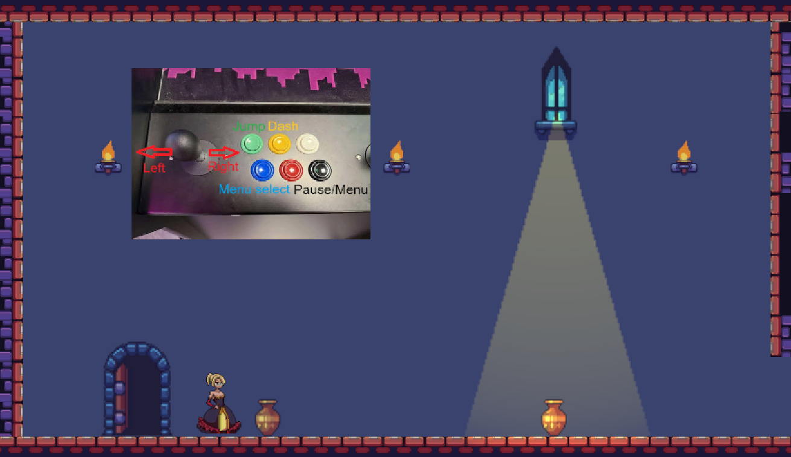

# Roll-a-ball 

### Roll-a-ball blog post(03/03/2025)

Link to the roll-a-ball game: https://github.com/AlexGhitun/GMD.git

This project is the first assignment received from the GMD course which involves following the Unity tutorial for creating a game where the player is the ball and tries to get collectibles while avoiding enemies.
This being the first time I use Unity it took not that much time to get used to its functionalities and to start understanding its capabilities. Overall I am excited about the posibilities of creating games and trying new things to see how the engine runs.

In the beginning, it was interesting to see how the objects get created within a game and scripts are written to let the user input actions to move their object. Creating different materials and the playground where the player is allowed to move gave me a lot of insight as to how much customizability there is for a developer when making a game.

After creating the player object and the playground, next step was to add the collectibles. These would be spinning in place with the help of a script, but one of the issues I didn't expect was having to make them dissapear after the player would collide with them, while also increasing a counter to represent how many collectibles were gathered. This was an interesting aspect as I assumed that there would be just a function within Unity to be able to do without the help of a script, but regardless it wasn't that difficult.

The system with tags in Unity makes it really easy to be able to detect different actions and interactions between the player and different objects. This was used for detecting collision between the player and the enemy and for making the enmy dissapear after the player collects all the collectibles. The text for the winning screen and losing screen were pretty easy to figure out, but I still need to learn a bit more about how the Scene works in Unity to be able to easier interact with the game objects.

Finally, I added the victory text once all 8 cubes were picked up and added a few obstacles such as walls, pillars, ramps and moveable cubes around the playground so that it would be a bit more difficult for the player to get every collectible. This turned out to also mess with the AI of the enemy movement as it would not detect the objects the first time around, and later on having to modify how high the enemy can climb surfaces and at which angle so that it would properly follow the player and not go through objects.

There are still a few issues I am trying to improve before adding new features, one of them being related to the shadows not being loaded properly when the player is moving across the playground and the AI pathing not always climbing on surfaces the right way(climbing ramps from the side).

Next features to implement for the game:

Obstacles in the course that move which upon collision with the player would toss the player around the playground, I need to take into consideration enemy behaviour

Extra level that could be a follow-up to the already existing one

Power-ups, such as freeze enemies, that could spawn on the playground at random times and places 

Timer mode, which could have an amount of time to complete each level, otherwise the player would lose (this feature could also be just an addition to add a timer in the UI for the user to be able to compare with previous runs)

### Roll-a-ball extra features (07/03/2025)

From the last merge there have been some new additions regarding the game. Now there is a second level which will automatically start once the player completes the first level by picking up all the collectibles. The second level also includes a spinning obstacle which will throw the player around if they position in its trajectory. The timer mode has been implemented as a time text that will be displayed all the time in the top right corner of the screen. This timer will stop once the player wins/loses or if the level resets.

There still are a few issues that need to be fixed out of which the most important is that if the player loses they are stuck in the "You lose!" screen and they need to restart the game if they wish to replay. Some other bugs that need to be fixed are that in the second level the second enemy will not dissapear if the player wins.

Some of the challenges that I encountered while implementing these features were handling scenes and figuring how does a game in general handle multiple levels so that they can either be loaded once the player clears the current one or how can the player choose what level they want to play. I figure out that there is a built-in "SceneHandler" that can be used to swap between scenes and give the impression of multiple levels for a user.

Another important challenge was figuring out how to create a script for the obstacle to spin like a helicopter blade in a horizontal plane, while also taking into consideration the interactions with the enemies, not just the player. I decided in the end that the enemies will have the capabilities of climbing over the obstacle, so that the player could not use the obstacle to its advantage and that the enemies would have an upper hand, creating some sense of balance.

There was a challenge related to the timer displayed in the top-right while writing the script, because I thought it is such an obvious choice for a game so it shouldn't be hard, but I was a bit confused how I should approach it so that it brings some value for the player and it is working as intended. Thought that its use would be most relevant if it displayed the time that took for a level run so that the player could compare attempts and strategies. Given this mentality I decided to make the timer stop after the level ends (either by winning or losing), while also progressing to the next level resets the timer from 00:00 so that each level could be compared separately from each other between attempts. 

Out of the "Next feature to implement for the game" I managed to implement 3 out of 4 feature that I proposed for myself, which I consider a success given that they all had their own challenges to overcome and I was careful not to break already existing functionalities while also trying to preserve a frame-rate independent code mentality so that I would avoid performance issues. 

# DraculaMorningRoutine

### Game Plan(29/03/2025)

This project is a 2D platformer game that will serve as the final submission for this course. It is inspired by the game "Celeste", but introduces a unique mechanic: the player must avoid staying in sunlight for too long.

The player takes on the role of a vampire navigating various levels in a casual "morning routine" to get a cup of coffee. The core gameplay will focus on traversal challenges, featuring a dash mechanic to help the player cross large gaps. I'm currently deciding whether this dash will simply be a short burst or if it will temporarily transform the player into a bat, allowing for limited flight—though balance is a concern, as I want to avoid making the ability overpowered.

Another planned feature includes mid-air shrines that recharge the dash ability, allowing for extended movement and creative platforming solutions.

So far, I’ve sourced a sprite model for the main character and several environment assets. I've implemented basic movement controls, including left-right facing animations, idle and walking animations, and I’m now working on jump and dash animations, which are still in development.

Development Progress and Challenges:

The most time-consuming part of the process so far has been finding assets that fit the vision of the game. Unity’s 2D tutorial provided a solid foundation for getting started, and I expect it to continue being helpful when creating level environments, the main menu, and the game’s UI.

One of the trickier mechanics to implement will be the dash ability. Not only will it require a fitting animation, but it also needs to be carefully scripted to avoid bugs and to ensure the player isn’t too powerful, which would reduce the game's challenge and enjoyment.

I’m still considering how player failure will be handled—whether through checkpoints, a health system, or restarting the level upon death.

Planned Environments:

The game will feature several thematic levels, including:

-A castle or manor

-A spooky garden or cemetery

-A haunted town leading to the final destination

The final area will contrast sharply with the rest of the game’s darker aesthetic—a bright, cheerful café that signifies the completion of the vampire’s quest for coffee.

Features to implement:

Sun rays and player death if staying too long in them

Player dash/transform

First level environment

Shrines for refreshing the player's ability to dash

UI(should include dash ability availability, timer for level)

Main menu and pause screen

OST/Sound effects to add to the game

First game draft:

### Development Update 1

During this phase of development, I completed the core player movement mechanics. I also added some visual flair, including a trail effect that activates during the player's second jump and dash, giving the gameplay a more dynamic feel.

A significant portion of the work went into sourcing suitable assets for the environment and designing a demo area set within a castle. This included implementing a camera system that transitions smoothly from one room to another. The transition is triggered by invisible checkpoints placed between rooms, which detect when the player passes through.

I also began working on traps that, upon collision with the player, trigger a death animation and disable player input. This ensures that the character remains motionless after dying. Since a respawn system hasn’t been implemented yet, the player is currently unable to regain control after dying — addressing this will be a priority moving forward.

One of the more challenging aspects was fine-tuning the camera movement. Initially, the camera would overshoot its target position, making it difficult for players to see both their character and the full room clearly. After some tweaking — including repositioning the rooms and adjusting the camera script — I managed to resolve the issue and achieve the intended behavior.

Another small but meaningful addition was implementing audio cues for the dash and jump actions, which helped make the controls feel more responsive and satisfying. I also added background music to make the game feel more engaging and enjoyable, helping to enhance the overall atmosphere of the demo area.

Looking ahead, my next focus will be integrating a proper respawn mechanic that resets the player's position and reactivates input after death. I also plan to begin fleshing out the enemy AI and work on more complex room layouts to better showcase the platforming mechanics and trap interactions. There’s still a long way to go, but progress so far has been steady and rewarding.

Features to implement:

Sun rays and player death if staying too long in them

✅Player dash/transform

✅First level environment

❌Shrines for refreshing the player's ability to dash(This has been replaced by giving the ability a cooldown)

UI(should include dash ability availability, timer for level)

Main menu and pause screen

✅OST/Sound effects to add to the game

### Development Update 2

In this development cycle, I focused on expanding the core gameplay systems, starting with the implementation of a proper respawn mechanic. I placed doors in each room that act as checkpoints — when the player passes by one, the door opens to indicate it has been activated. If the player dies, they now respawn at the last activated checkpoint. This adds a better sense of progression and removes some of the frustration during testing, especially in rooms with traps.

Another major addition was the light-based mechanic. The player can only remain in lit areas for a limited amount of time — specifically, 3 seconds. During this countdown, the character begins to blink red to warn the player that time is running out. If they don't leave the lit area in time, it results in death and triggers the respawn system. This mechanic added a layer of tension and urgency to the exploration and made the movement and timing feel more meaningful.

I also introduced a basic enemy AI to bring some challenge into the environment. These enemies currently patrol left and right along a defined path. I set up a simple patrol script using waypoints and physics-based movement, which gives the AI a predictable but effective presence in the level. Alongside the logic, I created animations for walking, idle and attacking states, which switch appropriately based on the AI’s movement.

To expand on enemy behavior, I added an attack script that detects when the player enters a defined range in front of the enemy. When triggered, the AI briefly stops moving and plays an attack animation. If the player is hit during this time, the same death and respawn process is initiated. This simple mechanic is enough to create tense moments, especially when combined with traps or the light countdown mechanic.

Getting the animations to sync with the movement and attacks required some fine-tuning, especially ensuring the transitions felt smooth and that hitboxes triggered at the right moment. I also had to refine the attack timing so that it was fair and gave the player a chance to escape if they reacted quickly enough.

Moving forward, I plan to continue working through the remaining items on the to-do list, with a particular focus on level design. Now that most of the core mechanics are in place, the next step is to populate the rooms with traps, enemies, and structures to make the gameplay more engaging and dynamic.

Features to implement:

✅Sun rays and player death if staying too long in them

✅Player dash/transform

✅First level environment

❌Shrines for refreshing the player's ability to dash(This has been replaced by giving the ability a cooldown)

❌UI(should include dash ability availability, timer for level) (The UI will be minimalistic to let the player have the whole room in view)

Main menu and pause screen

✅OST/Sound effects to add to the game

### Development Update 3

This development update has been all about improving the player's overall experience outside of core gameplay. I started by building out the main menu and pause screen, which now serve as a more polished entry point and in-game control hub. The main menu includes options for starting the game, adjusting settings, and exiting, while the pause screen allows players to resume, return to the main menu, or tweak audio settings on the fly.

A big focus was on implementing a script that allows players to adjust the music and sound effects volume in increments of 20%. These changes are not just temporary — they’re saved locally, so the player’s settings persist between sessions. This was done using Unity’s PlayerPrefs system, which made it straightforward to store and retrieve values like volume values when the game launches.

Controller support was another key part of this sprint. I updated the main menu to be fully navigable with a game controller, making the interface intuitive whether you’re playing with a keyboard or a gamepad. This involved reworking some of the UI navigation logic and testing various edge cases to ensure everything functioned as expected.

To test the controller compatibility, I deployed the build to the VIA Arcade Machine. It was a valuable experience to validate that the controls behaved correctly in that environment. After a few tweaks to input mapping, everything worked smoothly on the arcade machine — a big step toward making the game feel like a complete and polished arcade experience.

To help arcade players get started quickly, I also added an instructional image to the first room of the game. This visual shows the correct buttons to use on the arcade machine, giving immediate context and preventing confusion. It’s a small addition, but it makes a big difference in accessibility, especially for new players who may not be familiar with the control layout.

Instructional image in the first room:

Features to implement:

✅Sun rays and player death if staying too long in them

✅Player dash/transform

✅First level environment

❌Shrines for refreshing the player's ability to dash(This has been replaced by giving the ability a cooldown)

❌UI(should include dash ability availability, timer for level) (The UI will be minimalistic to let the player have the whole room in view)

✅Main menu and pause screen

✅OST/Sound effects to add to the game

### Final Update (06/05/2025)

Features to implement:

✅Sun rays and player death if staying too long in them

✅Player dash/transform

✅First level environment

❌Shrines for refreshing the player's ability to dash(This has been replaced by giving the ability a cooldown)

❌UI(should include dash ability availability, timer for level) (The UI will be minimalistic to let the player have the whole room in view)

✅Main menu and pause screen

✅OST/Sound effects to add to the game
